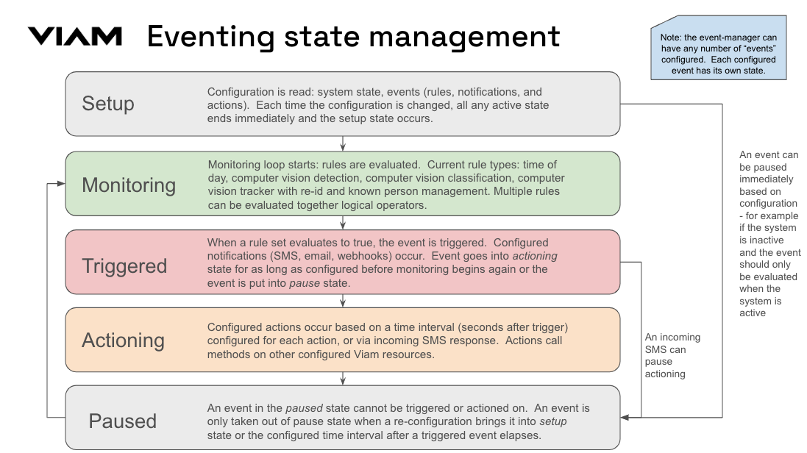

# event-manager modular service

*event-manager* is a Viam modular service that provides eventing capabilities using the generic component API.

The model this module makes available is viam:event-manager:eventing

The event manager is can be used in conjunction with a mobile app or web app, which provides a user interface for configuring events, viewing camera feeds, and viewing alerts.

The event manager can be configured with rules to evaluate, based on:

* Time of day
* Computer vision detections
* Computer vision classifications
* Computer vision tracker events (new person seen that is not an approved person)

When a rule is triggers, configured notification actions can occur of type:

* SMS (with media, e.g. MMS)
* Email
* GET push notification

Video of any triggered event is captured and stored in Viam data management via a video storage camera (configured as a dependency).

Actions can also be configured that occur either:

* After X seconds after an event is triggered
* Based on an SMS response

Configured actions are methods and payloads on other configured Viam resources.
Currently only generic components/services and vision services are supported.
Example action: An end user that receives an alert SMS can respond responds with '1', which activates a Kasa switch via a component do_command() call.

Triggered events can be queried and deleted with this module.



## API

The event-manager resource implements the [rdk generic API](https://github.com/viamrobotics/api/blob/main/proto/viam/component/generic/v1/generic.proto).

### do_command()

Examples:

```python
await em.do_command({"get_triggered": {"number": 5}}) # get 5 most recent triggered across all configured events
await em.do_command({"get_triggered": {"number": 5, "camera": "ipcam"}}) # get 5 most recent triggered for "ipcam" across all configured events
await em.do_command({"get_triggered": {"number": 5, "event": "Pets out at night"}}) # get 5 most recent triggers for event "Pets out at night"

await em.do_command({"delete_triggered": {"id": "FRgcwnOTZl4FEXiLG7p1KLcpmSX", "location_id": "dsafadad", "organization_id": "adasdsadasw"}}) # delete triggered event based on ID

```

#### get_triggered

Return details for triggered events in the following format:

```json
{ "triggered": 
    [
        {
            "event": "Unexpected person",
            "camera": "cam1",
            "time": 1703172467,
            "id": "edc519e5-85fe-42ab-af3c-506fcc827948",
            "organization_id": "72ff9713-adc7-4b15-a95b-2174468bde19",
            "location_id": "x7ahxaMJEfF"
        }
    ] 
}
```

Note that ID is the ID of the corresponding video in Viam's Data Management.

The following arguments are supported:

*number* integer

Number of triggered to return - default 5

*camera* string

Name of camera to return triggered for.  If not specified, will return triggered across all cameras.

*event* string

Name of configured event name to return triggered for.  If not specified, will return triggered across all events.

#### delete_triggered

Delete a triggered event by ID

```json
{
  "id": "<event_id",
  "location_id": "<location_id>",
  "organization_id": "<org_id>"

}
```

The following arguments are supported and required:

*id* string

The event ID.

*location_id* string

Location ID for the event to delete.

*organization_id* string

Organization ID for the event to delete.

## Viam event-manager Service Configuration

The service configuration uses JSON to describe rules around events.
The following example configures two events:

* The first triggers when the system is "active" and a configured detector Vision service sees a "Person", sending an SMS and email, and turning on a kasa plug immediately.
* The second triggers when the system is "active" and a configured tracker Vision service sees a "new-object-detected", sending an SMS and email, then turning on a kasa plug in 30 seconds or if an SMS response '1' is received.
If an SMS reponse of 2 is received, the kasa plug is turned off and the person detected is labeled.  If an SMS response of '3' is received, the kasa switch is turned off.

```json
{
    "mode": "active",
    "app_api_key": "daifdkaddkdfhshfeasw",
    "app_api_key_id": "weygwegqeyygadydagfd",
    "email_module": "shared-alerting:email",
    "sms_module": "shared-alerting:sms",
    "resources": {
        "kasa_plug_1": {"type": "component", "subtype": "generic"},
        "kasa_plug_2": {"type": "component", "subtype": "generic"},
        "cam1": {"type": "component", "subtype": "camera"},
        "cam2": {"type": "component", "subtype": "camera"},
        "vcam1": {"type": "component", "subtype": "camera"},
        "vcam2": {"type": "component", "subtype": "camera"},
        "tracker1": {"type": "service", "subtype": "vision"},
        "tracker2": {"type": "service", "subtype": "vision"}
    },
    "events": [
        {
            "name": "a person camera 1",
            "modes": ["active"],
            "pause_alerting_on_event_secs": 300,
            "detection_hz": 5,
            "rule_logic_type": "AND",
            "rules": [
                {
                    "type": "detection",
                    "confidence_pct": 0.6,
                    "class_regex": "Person",                    
                    "camera": "cam1",
                    "detector": "person_detector"
                }
            ], 
            "notifications": [{"type": "sms", "to": ["123-456-7890"], "preset": "alert"}, {"type": "email", "to": ["test@somedomain.com"], "preset": "alert"}],
            "actions": [
                {   
                    "when_secs": 0, 
                    "resource": "kasa_plug_1",
                    "method": "do_command",
                    "payload": "{'action' : 'toggle_on'}"
                }
            ]
        },
        {
            "name": "a new person camera 2",
            "modes": ["active"],
            "detection_hz": 2,
            "pause_alerting_on_event_secs": 120,
            "rule_logic_type": "AND",
            "rules": [
                {
                    "type": "tracker",
                    "camera": "cam2",
                    "tracker": "tracker1" 
                }
            ], 
            "notifications": [{"type": "sms", "to": ["test@somedomain.com"], "preset": "alert"}],
            "actions": [
                {   
                    "when_secs": 0, 
                    "resource": "vcam1",
                    "method": "do_command",
                    "payload": "{ 'command': 'save',
                                'from': '<<time('%Y-%m-%d_%H-%M-%S', -10)>>',
                                'to': '<<time('%Y-%m-%d_%H-%M-%S', 10)>>',
                                'metadata': 'SAVCAM--<<triggered_resource>>--<<event_name>>',
                                'async': True }"
                },
                {   
                    "sms_match": "1",
                    "when_secs": 60, 
                    "resource": "kasa_plug_2",
                    "method": "do_command",
                    "payload": "{'action' : 'toggle_on'}"
                },
                {   
                    "sms_match": "(2|3)",
                    "when_secs": -1, 
                    "resource": "kasa_plug_2",
                    "method": "do_command",
                    "payload": "{'action' : 'toggle_off'}"
                },
                {   
                    "sms_match": "2",
                    "when_secs": -1, 
                    "resource": "vcam1",
                    "method": "do_command",
                    "payload": "{'relabel' : {'<<triggered_label>>': 'Known person'}}"
                }
            ]
        }
    ]
}
```

### mode

*enum active|inactive (default: "inactive")*

Event manager mode, which is used in event evaluation based on configured event [modes](#modes)

### event_video_capture_padding_secs

*integer (default 10)*

For stored video, how many seconds before and after the event should be saved (for example, a value of 10 would mean 20 seconds of video would be stored).

### notifications

*object*

An object containing two lists:

*email* - A list of email addresses to send to for configured email notifications

*sms* - A list of SMS numbers to send to for configured SMS notifications

### camera_config

*object (required)*

An object containing configured physical camera component names as keys, and object values with:

*video_capture_camera* - The name of the associated configured video capture camera for the physical camera.

*vision_service*  - The name of the associated configured vision service to use.

### action_resources

*object*

If actions are configured, these are the associated resources to import and dependencies to use with the associated actions.
The key is the name of the configured resource, with object containing:

*type* - the resource type: component or service.
*subtype* - the resource subtype - currently only 'generic' and 'vision' are supported.

### detection_hz

*integer (default 5)*

How often rules are evaluated, best effort.

### app_api_key

*string (required)*

Used to interface with Viam data management for triggered event management

### app_api_key_id

*string (required)*

Used to interface with Viam data management for triggered event management

### pause_known_person_secs

*integer (default 120)*

How long to pause after a known person is seen before rules for the event are again evaluated.
Only applies to events that are triggered by a "tracker" rule.

### pause_alerting_on_event_secs

*integer (default 300)*

How long to pause after triggered event before rules for the event are again evaluated.

### email_module

*string (optional)*

The name of an email sending service configured as part of this machine that uses the API format of [this module](https://app.viam.com/module/mcvella/sendgrid-email)
If email notifications are configured, this is required.

### sms_module

*string (optional)*

The name of an SMS sending service configured as part of this machine that uses the API format of [this module](https://app.viam.com/module/mcvella/twilio-sms)
If SMS notifications are configured, this is required.

### events

*list*

Any number of events can be configured, and will be repeatedly evaluated as long as *pause_alerting_on_event_secs* is not currently being enforced.
If an event evaluates to true, a video save request occurs and any configured notifications will occur.

#### name

*string (required)*

Label for the configured event.
Used in logging and notifications.

#### modes

*list[enum home|away] (required)*

The list of modes in which this event will be evaluated.

#### rule_logic_type

*enum AND|OR|XOR|NOR|NAND|XNOR (default AND)*

The [logic gate](https://www.techtarget.com/whatis/definition/logic-gate-AND-OR-XOR-NOT-NAND-NOR-and-XNOR) to use with configured rules.
For example, if *NOR* was set and there were two rules configured that both evaluated false, the event would trigger.

#### notifications

*list*

Notifications types when an event triggers.

"type" is one of sms|email.

"preset" is a string specifying the name of the preset message to send.

##### actions

*list (required)*

A list of objects containing:

"resource" - The name of a configured action resource.
Currently only "generic" components and services, as well as vision services are supported.

"method" - The resource method to call

"payload" - The JSON payload to pass to the method.
Pass as a string that will be decoded to JSON.
Single quotes will get translated to double quotes so as to validate as proper JSON.
If your JSON string includes ```<<label>>``` it will be replaced with the the label detected when the event was triggered.

"sms_match" -  if a phone number that was notified when this event was triggered sends an SMS response and the response matches "sms_match" (regex), then this and any other matching actions will be taken.
Any other actions that could later be taken will be ignored until the event triggers again.

"when_secs" - How many seconds after the event triggers should the action occur.
If not specified or set to 0, will happen immediately.
If set to -1, will not happen unless sms_match causes it to occur.

#### rules

*list*

Rules define what is evaluated in order to trigger event logging and notifications.
Any number of rules can be configured for a given event.

##### rule type

*enum detection|classification|tracker|time*

If *type* is **detection**, *cameras* (list of configured cameras), *confidence_pct* (percent confidence threshold out of 1), and *class_regex* (regular expression to match detection class, defaults to any class) must be defined.

If *type* is **classification**, *cameras* (list of configured cameras), *confidence_pct* (percent confidence threshold out of 1), and *class_regex* (regular expression to match detection class, defaults to any class) must be defined.

If *type* is **tracker**, *cameras* (list of configured cameras) must be defined.

If *type* is **time**, *ranges* must be defined, which is a list of *start_hour* and *end_hour*, which are integers representing the start hour in UTC.

## Todo

* Support other types of webhooks
